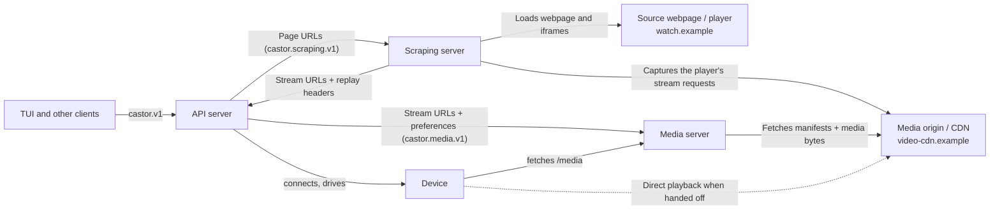
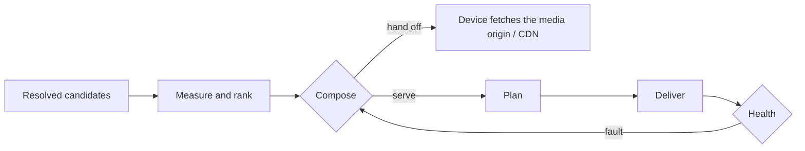

# Architecture

Castor ships three independent services in one binary. Clients speak the public API; API calls scraping and media over separate Connect/protobuf contracts.

## Clients and three services

The webpage and media origin are distinct: `watch.example` may load video from `video-cdn.example` (illustrative domains). Scraping discovers stream URLs; media fetches manifests and bytes from those URLs, never the original webpage. Direct playback lets the device fetch the CDN itself.

| Component | Owns | Does not do |
| --- | --- | --- |
| Clients | Catalog, sources, UI; public API calls | Service internals |
| API | Device discovery/control, cast defaults, orchestration, status, cancellation | Browser extraction or media ranking |
| Scraping | Chrome, frames, capture-document parsing; `browser`, `capture` | Devices, probing, ranking, playback |
| Media | Probing, ranking, recovery, ffmpeg, subtitles, `/media`; `resolver`, `transcode`, `whisper` | Webpages or device control |

Scraping returns unranked candidates with URLs, replay headers, MIME types, source pages, and manifest evidence. API translates public sources into media's page-free `Source`. A direct stream is explicitly chosen and only measured; a candidate list is ranked, with alternatives retained for recovery. Candidates are alternative URLs, not video chunks; one HLS/DASH URL can contain quality variants.

## Topologies

| Setup | What runs where |
| --- | --- |
| Local CLI | Missing services run embedded, with loopback RPC endpoints. |
| Shared media | Run `media-server`; clients set `server.url` and `server.token`. |
| Shared API | Run `api-server` on the devices' network, pointing at media and scraping; clients set `api.url` and `api.token`. |
| Shared scraping | Run `scraping-server` with Chrome; API sets `scraping.url` and `scraping.token`. |

Each standalone command starts only its own service. Standalone API defaults scraping to `http://localhost:8412`. Binary main composes embedded services through callbacks; embedded and remote services use the same HTTP contracts.

## Boundaries

- Services share generated contracts, not implementations; tests fake peers at their contracts.
- Service internals use Go's `internal` directories; only binary main imports service entry points. The TUI stays inside the CLI.
- Consumers declare narrow ports; entry points wire adapters. Decisions use capabilities, not device-family or site branches.
- Shared plumbing handles configuration, HTTP, authentication, watch state, and logging without domain logic.
- Only media needs cgo (Whisper); API and scraping build without it.

## The contracts

Buf generates Go and TypeScript Connect clients from `proto/`. RPC edges validate requests and peer responses with protovalidate; contracts are not stable yet. API resolves optional preferences against its validated `cast` defaults into media's complete `PlaybackSettings`.

- Device types, audio/video codecs, failure codes, and recovery actions are enums.
- Subtitles select disabled, automatic detection, or a language; an absent API selection inherits defaults.
- Status selects connecting, extracting, measuring, or casting with state-specific data. Terminal results select completed, stopped, or a typed failure.
- `Stream` holds playback data; `StreamCandidate` adds discovery evidence. Unknown ranked bitrate is absent, not zero. Media ignores unknown capability enum values rather than assuming support.

| Contract | RPCs |
| --- | --- |
| `castor.v1` (clients → API) | `ListDevices`; `Cast`, `Stop`, `ListCasts`; `Watch` (status, live logs, final `Ended`); `Resolve` (preview, best first). |
| `castor.scraping.v1` (API → scraping) | `ScrapingService.Resolve`: HTTP(S) pages → unranked candidates. Never calls media. |
| `castor.media.v1` (API → media) | `CastService.Start`, `Stop`, `Watch`; `StreamService.Rank`; `DeviceService.Drive` (capabilities and command stream), `Answer` (command results). |

## A cast, start to end

1. API returns a cast ID, connects the device (`CONNECTING`), then resolves pages through scraping (`EXTRACTING`). Direct streams bypass scraping.
2. API starts media with streams and complete preferences, opens `Watch` and `Drive`, and lends the device's capabilities. Media measures/ranks (`MEASURING`), chooses delivery, then plays (`CASTING`). A cast without a lent device is abandoned after a minute.
3. Media sends device commands down `Drive`; API executes them and returns `Answer`. Media decides playback and recovery without needing access to the device's network.
4. API forwards status and live, unstored logs to watchers, ending with `Ended`. The cast belongs to API, not the UI; the CLI chooses to stop it on Ctrl+C. Media can continue after its lender leaves until it needs device control again.

Stopping during extraction cancels scraping and releases the device without creating a media cast. Once media starts, API retries stop until accepted. Shutdown drains each service's own work.

## Inside the media engine

- **Rank:** prefer the tallest stream within `cast.max_height`; unmeasured candidates are last resorts. Media's HLS/DASH readers handle playback, not capture-document parsing.
- **Compose:** hand off compatible streams to self-fetching devices unless `delivery: serve`; otherwise remux or use a read-once encoding pipeline (e.g. DLNA). `--debug` explains the choice.
- **Plan/deliver:** copy or encode each track, scale to the ceiling, and burn Whisper subtitles into read-once casts. Use a working GPU encoder, falling back to software. Internal delivery listens on loopback behind `/media`.
- **Recover:** detect stalls, slow reads, or stopped fetching; revise the attempt, cheapest first, or try the next candidate.

## Trust boundary

Services use independent bearer tokens; health checks and device-facing `/media` are open. Invalid downstream credentials are API misconfiguration, not caller authentication failures. Replay headers reach media but are stripped from public listings. See [SECURITY.md](SECURITY.md).
